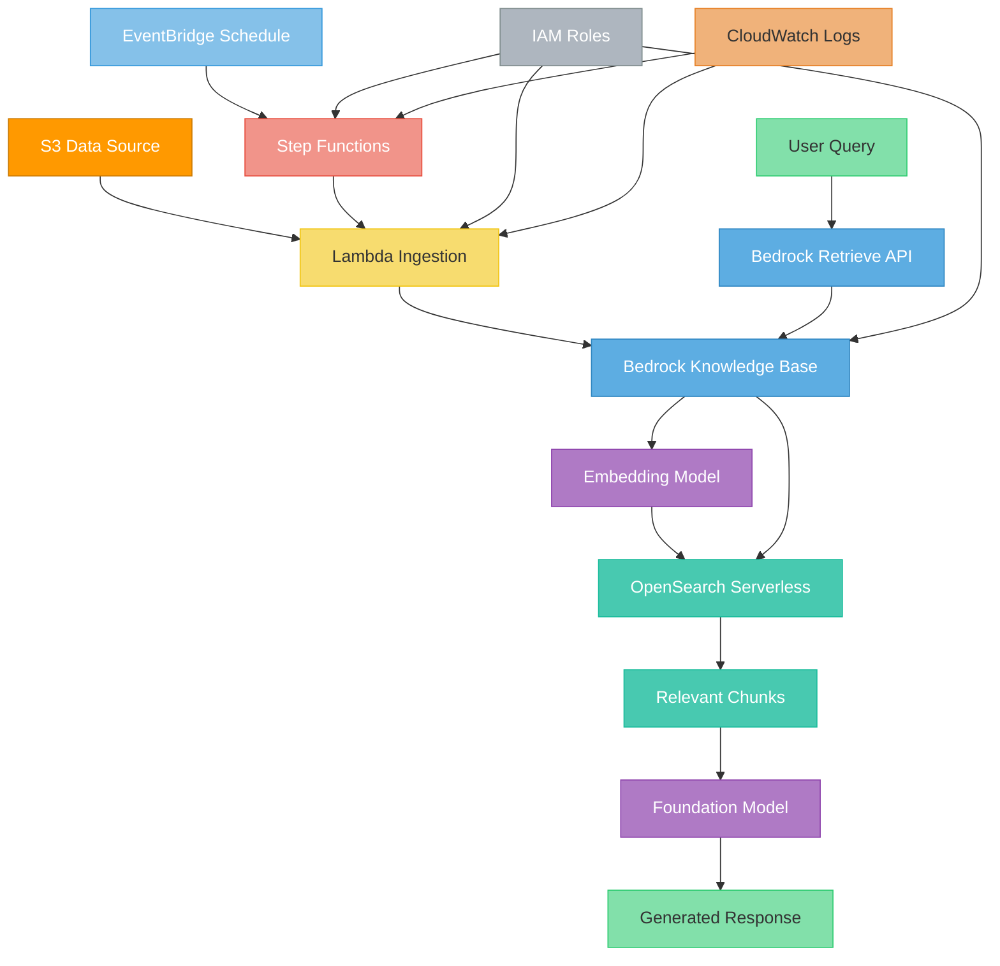

# terraform-aws-rag-pipeline

Terraform module for deploying an AWS Retrieval-Augmented Generation (RAG) pipeline using Bedrock Knowledge Bases, OpenSearch Serverless, S3, Lambda, and Step Functions.

## Architecture



## Features

- **Bedrock Knowledge Base** - Managed RAG with configurable embedding models
- **OpenSearch Serverless** - Vector store with encryption and access policies
- **S3 Data Source** - Versioned, encrypted bucket with configurable prefixes
- **Lambda Ingestion** - Serverless function to trigger ingestion jobs
- **Step Functions** - Orchestrated ingestion pipeline with status polling
- **EventBridge Schedule** - Automated periodic ingestion
- **IAM Roles** - Least-privilege roles for all components
- **Chunking Configuration** - Fixed-size, hierarchical, or semantic chunking

## Usage

```hcl
module "rag_pipeline" {
  source = "path/to/terraform-aws-rag-pipeline"

  name = "my-rag"

  embedding_model_id  = "amazon.titan-embed-text-v2:0"
  data_source_prefix  = "documents/"
  ingestion_schedule  = "rate(1 day)"

  tags = {
    Environment = "dev"
  }
}
```

## Examples

- [Basic](examples/basic/) - Knowledge base with S3 source and Lambda
- [Complete](examples/complete/) - Full pipeline with Step Functions and scheduling

## Requirements

| Name      | Version  |
|-----------|----------|
| terraform | >= 1.5.0 |
| aws       | >= 5.0   |

## License

MIT License - see [LICENSE](LICENSE) for details.
